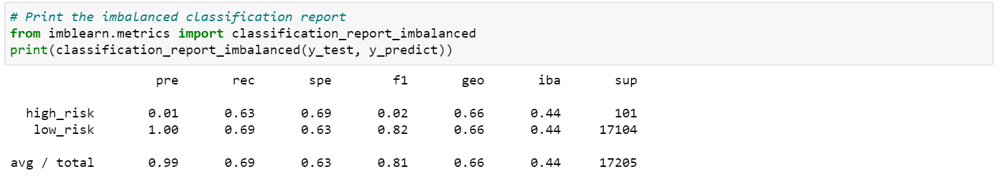
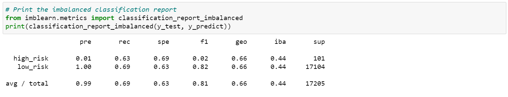

# Credi Risk Analysis

## Purpose:
The aim of this analysis is to apply skills in data preparation, statistical reasoning, and machine learning to solve credit card risk. Credit risk is an inherently unbalanced classification problem, as good loans easily outnumber risky loans. Therefore, I will use imbalanced-learn and scikit-learn libraries to employ the following techniques to train and evaluate models with unbalanced classes:
* Oversampling the data using the RandomOverSampler and SMOTE algorithms
* Undersampling the data using the ClusterCentroids algorithm
* Use a combinatorial approach of over- and undersampling using the SMOTEENN algorithm
* Use BalancedRandomForestClassifier and EasyEnsembleClassifier that reduce bias to predict credit risk.

## Results:
### Models' Performance Evaluation:

1. Oversampling the data using the RandomOverSampler:
  
   Balanced accuracy score: 0.67
  
  

2. Oversampling the data using the SMOTE:

   Balanced accuracy score: 0.66
   
  

3. Undersampling the data using the ClusterCentroids algorithm

   Balanced accuracy score: 0.66
   
  

4. Combinatorial approach of over- and undersampling using the SMOTEENN algorithm

   Balanced accuracy score: 0.66
   
  

5. BalancedRandomForestClassifier

   Balanced accuracy score: 0.79
   
  

6. EasyEnsembleClassifier

   Balanced accuracy score: 0.93
   
  

The results shows that resampling techniques, oversampling, undersampling or combination low recall scores for both low and high risk loans. Precision scores were low for high risk loan and high for low risk ones. Recall scores were also low. The balanced accuracy scores remained were low and did not exceed 0.67.

BalancedRandomForestClassifier and EasyEnsembleClassifier models reduced bias and improved balanced accuracy scores significantly reaching 0.93 for the latter model. 
Precision scores were low for high risk loan and high for low risk ones. Recall scores were improved with 0.7 and 0.87 for high risk and low risk respectively.

## Summary: 
Based on the performance of these models,  BalancedRandomForestClassifier and EasyEnsembleClassifier models should be used to predict credit risk.I would recommend to use the EasyEnsembleClassifier model as it was the best model in terms of balanced score accuracy and recall scores.
